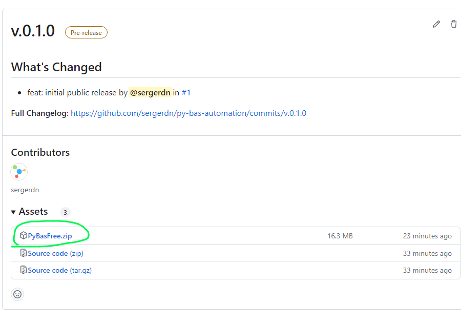

# py-bas-automation

**Note:** This project originally started as a `working proof of concept` and does not aim to offer extensive support or
documentation. It serves as a fundamental demonstration of the concept and should be considered a foundation for further
development or experimentation.

## Description

This library enables you to work with BAS (BrowserAutomationStudio) using headless Chromium browsers and a
customizable Windows GUI program, while controlling it with Python ❤️.


## Key Features

- **BrowserAutomationStudio Integration:** Run BAS seamlessly with headless browsers while enjoying the convenience of a
  user-friendly and customizable Windows GUI program
  through [BrowserAutomationStudio](https://bablosoft.com/shop/BrowserAutomationStudio).
- **Unique Fingerprint Feature:** The application includes a unique feature that assigns a  `fingerprint`  to each
  browser instance using [FingerprintSwitcher](https://fingerprints.bablosoft.com/). Please be aware that this is
  **paid** feature.
- **Playwright Control:** The application leverages [Playwright](https://playwright.dev/python/) to efficiently manage
  and control BAS.

## Understanding the Workflow

The functioning of BAS (Browser Automation Studio) involves the following steps:

1. **Initial Execution:** Upon initiation, BAS runs [cmd_initial.py](./cmd_initial.py). This script is responsible for
   creating tasks and storing them on the disk for later use.
2. **Data Acquisition and Browser Configuration:** BAS then retrieves the necessary data, configures, and launches
   browser instances based on the tasks provided earlier.
3. **Task Execution:** Following the browser setup, BAS executes [cmd_worker.py](./cmd_worker.py) using the  `task_id`
   and  `remote-debugging-port`  number as command-line parameters.
4. **Task Handling:** [cmd_worker.py](./cmd_worker.py) obtains both the  `ws_endpoint`  and  `remote-debugging-port`
   from the command line. It then manages complex tasks using [Playwright](https://playwright.dev/python/). These tasks
   can range from opening a webpage to filling out forms or even taking screenshots.
5. **Task Completion:** Once the tasks have been completed, BAS terminates the browser instances and exits.

The result of running [cmd_worker.py](./cmd_worker.py) is as follows:

```json
{
  "tasks_file": "C:\\Users\\Administrator\\AppData\\Local\\PyBASProfilesTasks\\tasks.json"
}
```

This is an example of the created `tasks_file`:

```json
[
  {
    "task_id": "519e8739-dd93-4ad9-b3da-22c913a40c69",
    "browser_settings": {
      "components": {
        "widevine": "enable",
        "safe_browsing": "enable",
        "components": "enable"
      },
      "network": {
        "enable_qiuc_protocol": true
      },
      "rendering": {
        "maximum_fps": 30
      },
      "browser_version": "default",
      "command_line": [
        "--disk-cache-size=104857600",
        "--disable-gpu-program-cache",
        "--disable-gpu-shader-disk-cache",
        "--disable-features=GpuProcessHighPriorityWin,GpuUseDisplayThreadPriority",
        "--lang=en"
      ],
      "profile": {
        "profile_folder_path": "C:\\Users\\Administrator\\AppData\\Local\\PyBASProfiles\\tmp0y03_e5x",
        "always_load_fingerprint_from_profile_folder": false,
        "always_load_proxy_from_profile_folder": false
      },
      "proxy": null,
      "fingerprint": {
        "safe_canvas": true,
        "use_perfect_canvas": true,
        "safe_webgl": true,
        "safe_audio": true,
        "safe_battery": true,
        "use_font_pack": true,
        "safe_element_size": false,
        "emulate_sensor_api": true,
        "emulate_device_scale_factor": true
      }
    }
  }
]
```

This file contains task details such as browser settings, network configurations, rendering options, and fingerprint
settings, among other things.

## System Requirements

For the optimal running of this application, the following system requirements are necessary:

- **Operating System:** The application is compatible with Windows 10/11 and Windows Server 2022 (tested on 21H2).
- **Python:** Ensure you have Python 3.11 or higher installed. If not, you can download it from the official
  Python [website](https://www.python.org/downloads/).
- **Poetry:** This is a necessary tool for managing Python dependencies. You can find the installation guide on the
  official Poetry [documentation](https://python-poetry.org/docs/#installation).
- **Git:** The application requires Git for version control. If it's not already installed on your system, you can
  download it from the official Git [website](https://git-scm.com/downloads).
- **Make:** This is an optional tool, it can be downloaded from the
  Chocolatey [website](https://community.chocolatey.org/packages/make).
- **FingerprintSwitcher License:** Please note that this is a **paid** feature. You will need a valid license
  for [FingerprintSwitcher](https://fingerprints.bablosoft.com/) to access its functionalities.

## Installation Guide

### Installing the Current Development Version

To work with the most recent development version of `pybas-automation`, follow the steps outlined below:

1. **Clone the Repository:** Clone the  `py-bas-automation`  repository from GitHub.
2. **Navigate to the Directory:** Once cloned, navigate to the  `py-bas-automation`  directory on your local system.
3. **Install Dependencies:** With Poetry, install all the necessary dependencies.

Here are the corresponding commands for each step:

```bash
git clone git@github.com:sergerdn/py-bas-automation.git
cd py-bas-automation
poetry install
```

### Installing the Latest Release from pypi.org (Currently not recommended)

If you wish to incorporate  `pybas-automation`  into your project, execute the following command:

```bash
poetry add pybas-automation
```

Please note that this is not currently recommended as the latest release may have unresolved issues.

## How to Run the Application

1. **Download the BAS Program:** Start by downloading the latest version of the compiled BAS program, named
   _PyBasFree.zip_. This can be found under the [Releases](https://github.com/sergerdn/py-bas-automation/releases)
   section on the GitHub page. Once downloaded, extract the contents and run _PyBasFree.exe_.
   

2. **Set Variables in the BAS GUI:** After running the BAS program, proceed to set the necessary variables within the
   BAS graphical user interface (GUI).
   

3. **Start the Program:** Once all variables have been set, click the "OK" button to initiate the program.
   

## Advanced Usage

Here's a basic example of using `py-bas-automation`:

- [Initial script](./cmd_initial.py) to create tasks:

```python
import json
from pybas_automation.task import BasTask, TaskStorage, TaskStorageModeEnum
from pybas_automation.browser_profile import BrowserProfileStorage

fingerprint_key = "your_fingerprint_key"

# Create a new task
task = BasTask()

# Save the task to storage, default location is
# C:\Users\{username}\AppData\Local\PyBASTasks
task_storage = TaskStorage(mode=TaskStorageModeEnum.READ_WRITE)
task_storage.save(task)

# Initialize a browser profile storage, default location is 
# C:\Users\{username}\AppData\Local\PyBASProfiles
browser_profile_storage = BrowserProfileStorage(fingerprint_key=fingerprint_key)

# Create 20 fresh profiles on disk
for _ in range(0, 20):
    browser_profile = browser_profile_storage.new()

# Add created browser profiles to tasks
for browser_profile in browser_profile_storage.load_all():
    task = BasTask()
    task.browser_settings.profile.profile_folder_path = browser_profile.profile_dir
    task_storage.save(task=task)

task_file_path = task_storage.task_file_path

# print path to tasks file for use it in BAS
print(json.dumps({"tasks_file": str(task_file_path)}, indent=4))
```

- [Worker script](./cmd_worker.py) to retrieve the ws_endpoint from bas and handle the complex tasks:

```python
from uuid import UUID
from playwright.sync_api import sync_playwright
from pybas_automation.task import BasTask, TaskStorage, TaskStorageModeEnum
from pybas_automation.browser_remote import BrowserRemote

# skip code to getting ws_endpoint from cmd line ...
task_id = UUID("some_task_id_that_we_getting_from_cmd_line_from_BAS")

# Create a new task storage
task_storage = TaskStorage(mode=TaskStorageModeEnum.READ)
found_task = task_storage.get(task_id=task_id)
# Do something with task if needed...
# Save the task to storage, default location is

# Skip code to getting remote_debugging_port from cmd line ...
remote_debugging_port = 9222

remote_browser = BrowserRemote(remote_debugging_port=remote_debugging_port)

# Get ws_endpoint from remote_debugging_port
remote_browser.find_ws()
ws_endpoint = remote_browser.ws_endpoint

with sync_playwright() as pw:
    # Connect to an existing browser instance
    browser = pw.chromium.connect_over_cdp(ws_endpoint)
    # Get the existing pages in the connected browser instance
    page = browser.contexts[0].pages[0]
    # Doing some work with page
    page.goto("https://playwright.dev/python/")
```

## Planned Improvements:

- [ ] Add Proxy support.
- [ ] Include build scripts for converting Python files to executable format.
- [ ] Expand the repository with more illustrative examples.
- [ ] Develop end-to-end tests to thoroughly assess the entire workflow.

## Contributing

Your ideas and contributions are highly valued. Please do not hesitate to open
an [issue](https://github.com/sergerdn/py-bas-automation/issues/new) if you have suggestions, questions, or if you
would like to contribute to its enhancement.

## License

[LICENSE](./LICENSE)